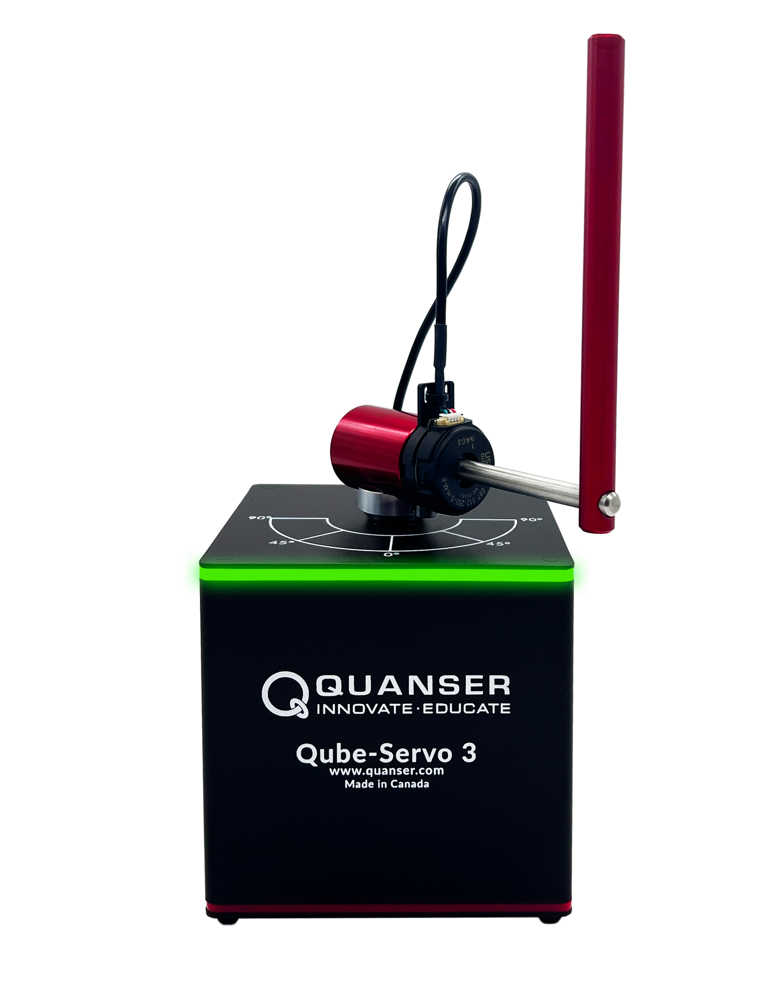

# Quanser Qube Servo 3

## General
- ???

## Project Structure

### [`Python/`](Python/) — Main software solution
The Python solution is the primary codebase, equivalent to a C/C++ solution folder. It is structured into sub-packages and runs on the host PC.

| File / Folder | Description |
|---|---|
| [`main.py`](Python/main.py) | Entry point. Starts the UART listener on a background thread and runs the main controller loop on the main thread. |
| [`Config.py`](Python/Config.py) | Singleton config class. Reads `Config.yaml` at startup and exposes all values as flat attributes (e.g. `config.UART_PORT`). Import with `from Config import config` anywhere. |
| [`Config.yaml`](Python/Config.yaml) | Project-wide settings — debug flag, UART port and baud rate. Equivalent to a C `#define` header. |
| [`requirements.txt`](Python/requirements.txt) | Python package dependencies (`pyserial`, `numpy`, `pyyaml`). Install with `pip install -r Python/requirements.txt`. |

#### [`Python/Controller/`](Python/Controller/) — Control algorithms
PD/LQR control logic for the Qube Servo 3, using the Quanser HIL API.

| File | Description |
|---|---|
| [`Controller.py`](Python/Controller/Controller.py) | PD controller implementation. Includes `ddt_filter` (derivative with Tustin-discretised low-pass), `lp_filter`, `createSquareWave`, and the main `PD_Control()` loop that reads encoder data and drives the motor via the HIL card. |
| [`ControllerTest.py`](Python/Controller/ControllerTest.py) | Minimal HIL smoke-test. Opens the `null_device`, performs a single `read_analog_write_analog` call and reports pass/fail. |

#### [`Python/tiva_microcontroller/`](Python/tiva_microcontroller/) — Tiva platform interface
Communication layer between the host PC and the TI Tiva microcontroller.

| File | Description |
|---|---|
| [`UART.py`](Python/tiva_microcontroller/UART.py) | `UART` class wrapping `pyserial`. Handles connection errors with descriptive messages, provides `read_line()` for single-line reads and `loop()` for continuous listening. Also exposes `list_ports()` helper. |

---

### [`Virtual_model/`](Virtual_model/) — Robot description
| File | Description |
|---|---|
| [`Qube_Servo_3.urdf`](Virtual_model/Qube_Servo_3.urdf) | URDF robot model of the Qube Servo 3, intended for use in simulation environments (e.g. RViz, Gazebo). Currently a work in progress. |

---

### [`C/`](C/) *(planned)* — Embedded firmware
Future home of the embedded C/C++ firmware running on the Tiva microcontroller. Will handle low-level motor control, encoder reading, and UART communication back to the host.

---

### [`Guides/`](Guides/) — Developer guides
Setup and workflow documentation. See the [Guides](#guides) section below.

---

### [`Images/`](Images/)
Project images used in the README.

## Product links
- Product page: https://www.quanser.com/products/qube-servo-3
- Product resourses: https://github.com/quanser/Quanser_Academic_Resources/tree/dev-windows

## Guides
- [Virtual Environment Setup](Guides/VIRTUAL-ENVIRONMENT.md) — How to create, activate and deactivate the Python virtual environment, install dependencies from `requirements.txt`, and keep it up to date with `pip freeze`.
- [Git Setup](Guides/GIT-SETUP.md) — How to clone the repository, configure Git, and get started with version control for this project.
